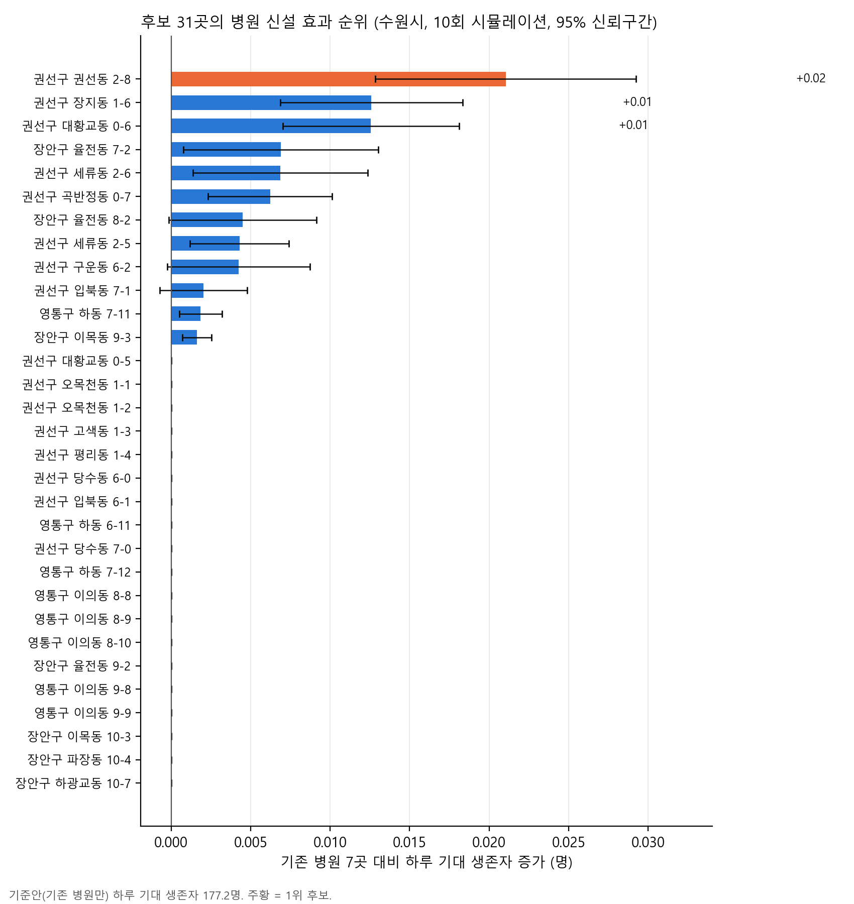
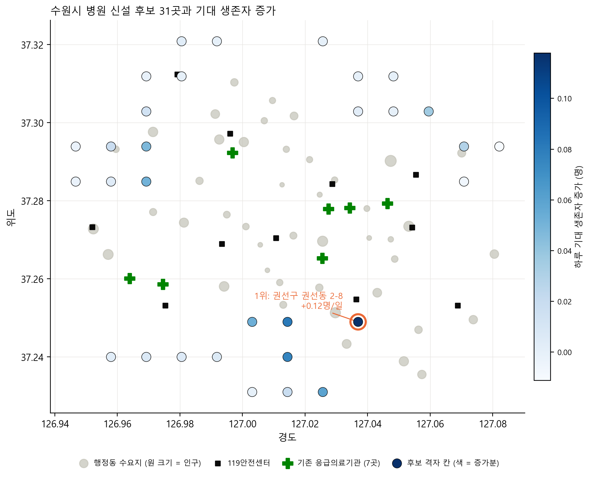
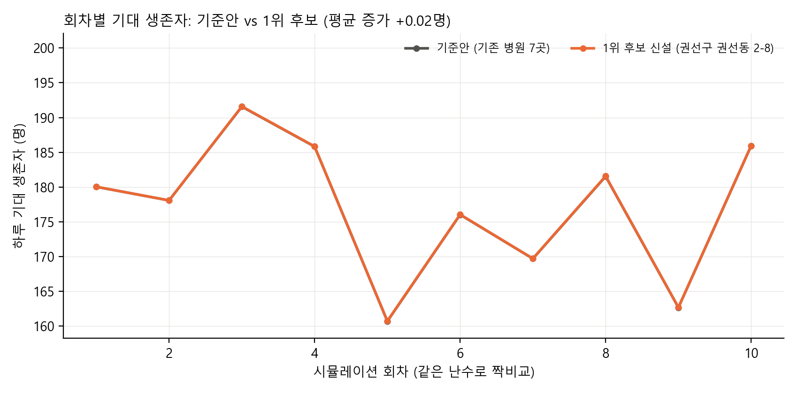
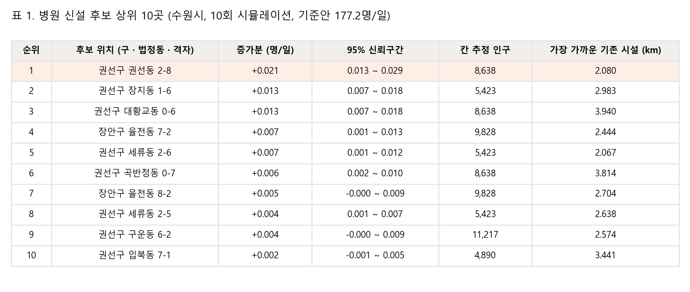
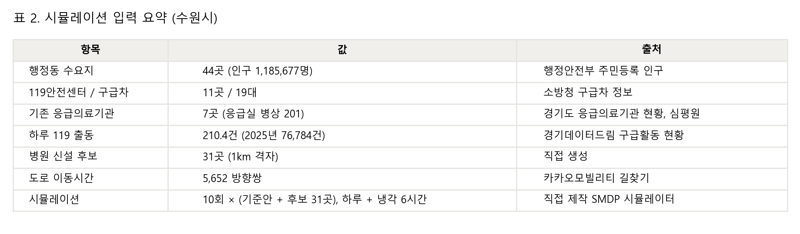

# 최적의 병원 신설 입지 프로젝트

* [연구 과제 7] 기타 연구 주제　　　　　　　　　2518 최지완

## 1. 탐구 주제 및 문제 정의

본 보고서는 실제 경기도 수원시를 1km 격자로 나눈 시뮬레이션에서 병원 신설 시 환자의 기대 생존자 수를 최대화하는 위치를 찾는 것을 목적으로 한다.

## 2. 데이터 수집 및 데이터 속성 분류

* 공공 데이터: 행정안전부 주민등록 인구통계에서 수원시 44개 행정동 인구를 수집했다. 수치형(이산형)이다.
* 공공 데이터: 경기도 응급의료기관 현황과 건강보험심사평가원 병원현황에서 응급의료기관 7곳의 위치·등급과 응급실 병상 수를 수집했다. 등급은 범주형(순서형), 병상 수는 수치형이다.
* 공공 데이터: 소방청 구급차 정보에서 119안전센터 11곳의 위치와 구급차 19대를 수집했다. 수치형(이산형)이다.
* 공공 데이터: 경기데이터드림 구급활동 현황에서 2025년 수원시 119 출동량(하루 210.4건)을 수집했다. 수치형(이산형)이다.
* 공공 데이터(API): 카카오모빌리티 자동차 길찾기 API로 거점·행정동·병원·후보지 사이의 도로 이동시간(분)을 직접 조회했다. 수치형(연속형)이다.
* 자체 데이터: 실험법으로, 1km 격자 후보지 31곳을 직접 만들고 시뮬레이터를 반복 실행해 후보별 기대 생존자 수를 산출했다. 수치형(연속형)이다.

## 3. 데이터 전처리 및 분석 방법

[전처리]
* 행정동 인구를 기준으로 환자 발생량을 배분하고 행정복지센터를 환자 발생 위치로 사용한다.
* 수원시를 1km 격자 154칸으로 나눈 뒤 시외, 인구 0, 인구 상위 30%(NIMBY 고려), 기존 의료시설 2km 이내, 도로가 없는 칸을 제외해 후보지 31곳을 선정한다.
* 거점→행정동, 행정동→병원·후보, 병원·후보 사이의 이동시간 5,652쌍을 카카오모빌리티 길찾기로 전부 수집한다.
* 위 자료를 하나의 시나리오 파일로 묶는다. 환자 유형 비율과 생존함수 계수는 별도 계수 파일에서 읽는다.

[규칙]
* 후보지는 수원시 위에 깐 1km 격자 칸 중심이며, 시 밖·인구 0·인구 상위 30%·기존 의료시설 2km 이내·도로 없는 칸을 빼면 154칸 중 31곳이다.
* 환자는 44개 행정동 행정복지센터 위치에서 발생하며, 2025년 수원시 실제 119 출동 건수(하루 210.4건)를 행정동 인구 비율로 나눠 시간당 포아송 과정으로 생성한다.
* 환자는 심정지·뇌졸중·외상·경증 4유형이며, 골든타임까지 생존확률 1, 이후 매 분 지수적으로 감소한다.
* 이동시간은 카카오모빌리티 길찾기 API의 실제 도로 이동시간(분)만 쓴다.
* 가장 가까운 유휴 구급차가 출동하고, 병원은 기대 생존확률이 가장 높은 곳을 고르며, 병상이 없으면 성공률이 크게 떨어지고 최대 2회 전원한다.
* 신설 병원은 모두 지역응급의료기관·응급실 20병상으로 같게 두어 위치 효과만 비교한다.
* 1회 시뮬레이션은 하루 동안 환자를 발생시키고 이후 6시간은 남은 환자만 종결까지 진행한다.
* 목적함수는 기대 생존자 수이며, 기존 병원만 있을 때 대비 증가량이 가장 큰 후보를 고른다. 각 후보와 기준안은 같은 난수로 10회 반복해 짝비교하고 평균과 95% 신뢰구간으로 보고한다.
* 도로 혼잡, 계절성, 특정 날짜, 시·군 경계 밖의 병원·구급차·환자는 반영하지 않는다.

## 4. 시각화 및 결과

* 기존 병원 7곳만 있을 때 하루 기대 생존자는 185.6명(95% 신뢰구간 178.6~192.6)이다.
* 후보 31곳 중 1위는 권선구 권선동 격자 2-8로, 신설 시 하루 기대 생존자가 0.118명(0.053~0.183) 증가한다. 2위 권선구 세류동 2-6(+0.081), 3위 권선구 장지동 1-6(+0.076), 4위 곡반정동 0-7(+0.060), 5위 세류동 2-5(+0.053) 순이다.
* 31곳 중 9곳은 신뢰구간 하한이 0보다 커 증가 효과가 확인되고, 나머지 22곳은 효과가 0과 구분되지 않는다. 영통구 하동 7-12 등 3곳은 평균이 음수다.

[그림 1] 후보 31곳의 병원 신설 효과 순위 (95% 신뢰구간)

[그림 2] 후보 위치와 기대 생존자 증가 (색이 진할수록 증가분 큼)

[그림 3] 회차별 기대 생존자: 기준안 vs 1위 후보

[표 1] 병원 신설 후보 상위 10곳

[표 2] 시뮬레이션 입력 요약

## 5. 결론 및 제안

* 신설 효과는 위치에 따라 크게 갈린다. 1위(0.118명)는 중앙값 후보의 24배이며, 상위 5곳이 모두 권선구 남부(권선동·세류동·장지동·곡반정동)에 몰려 있다. 이 지역은 인구가 많지만 기존 응급의료기관 7곳이 팔달·장안·영통 쪽에 치우쳐 있어 도로 이동시간이 길기 때문이다.
* 반대로 기존 병원이 가까운 영통구·장안구 북부 후보는 효과가 0에 가깝거나 음수다. 병원을 추가해도 환자가 분산될 뿐 생존자가 늘지 않는다.
* 다만 증가분의 절대 크기는 하루 0.12명, 연간 약 43명으로 기준안의 0.06% 수준이다. 환자의 약 79%가 경증이라 도착이 몇 분 빨라져도 생존이 거의 변하지 않기 때문이며, 심정지·외상 환자만 따로 보면 효과가 더 뚜렷할 것으로 예상된다.
* 따라서 수원시에 응급병원을 1곳 신설한다면 권선구 남부(권선동 일대)가 최우선 후보이며, 실제 추진 시 해당 격자의 부지 확보 가능성과 심정지·외상 환자 기준 재평가가 필요하다.

[한계]
* 환자 발생 위치는 행정복지센터 대표점이며 실제 신고 좌표가 아니다.
* 도로 이동시간은 수집 시점(2026-09-10)의 1회 값이며 구급차 우선통행이 반영되지 않았다.
* 후보 격자 칸의 토지·용도지역·면적은 검증하지 않았다.
* 시뮬레이션 10회는 통계적으로 충분하지 않아 하위 후보의 순위는 바뀔 수 있다.

## 부록

* 코드와 데이터: https://github.com/CHOI-0912/2026_2_CS_OT_6
* 시뮬레이터(브라우저 재생): https://choi-0912.github.io/2026_2_CS_OT_6/outputs/suwon_folium_simulator.html
* 결과 파일: `outputs/suwon_grid_k1/hospital_placement_result.json`
